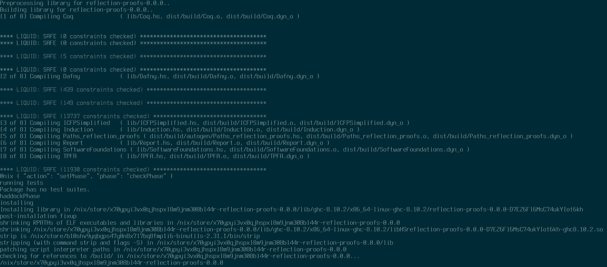

# Reflection Proofs

This is a practice repository of proofs written in Liquid Haskell in the style
of _Theorem Proving for All_ [[pdf](https://arxiv.org/pdf/1806.03541.pdf)] by
Niki Vazou.

Since the repository only contains proofs, there's nothing to run. You can
check the proofs by compiling the code with the Liquid Haskell plugin.

## Index of proofs

* `lib/Coq.hs` -- Only a few "quickcheck style properties" here. Not much
  interesting.
* `lib/Dafny.hs` -- Proofs from the first chapters of _Verified Programming in
  Dafny_ [[pdf](http://www.doc.ic.ac.uk/~scd/Dafny_Material/Lectures.pdf)].
* `lib/ICFPSimplified.hs` -- Simplified proof of CBCAST deliverability
  predicate translated from Agda
  [[gist](http://www.doc.ic.ac.uk/~scd/Dafny_Material/Lectures.pdf)].
* `lib/Induction.hs` -- Nothing yet.
* `lib/Report.hs` -- All of the examples from a report I wrote for this project
  for class.
* `lib/SoftwareFoundations.hs` -- Nothing yet.
* `lib/TPFA.hs` -- Several examples transcribed from _Theorem Proving for All_
  [[pdf](https://arxiv.org/pdf/1806.03541.pdf)].

# Compile & Check the Proofs

To compile and check the proofs, use haskell stack or nix.

## Nix

Run `nix-build`.

## Stack

Run `stack build`. If using `stack` on nix be sure to eable nix integration in the `stack.yaml`.
